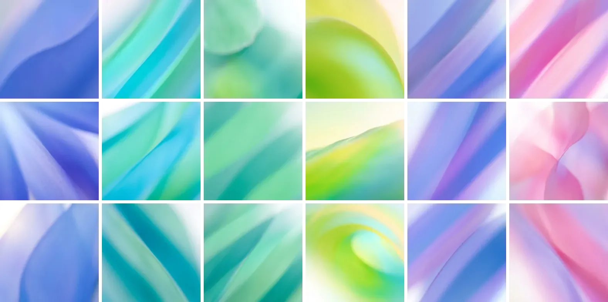

# gradient

Nature-like gradients for React: 101 photographs of light through paper, one for every seed, the same one every time.



## Use

```sh
npm install github:sinbad-io/gradient
```

```tsx
import { Gradient } from "gradient";

<Gradient seed="project_42" style={{ width: 320, aspectRatio: "2 / 1" }} />;
```

The box has no content of its own, so give it a size. It shows the tile's mean colour while the image loads.

| Prop      | What it does                                                                                                                                         |
| --------- | ---------------------------------------------------------------------------------------------------------------------------------------------------- |
| `seed`    | A number or a string. Use something stable about the subject: an id, not a name.                                                                     |
| `palette` | `blue`, `cyan`, `green`, `lime`, `periwinkle` or `pink`.                                                                                             |
| `mood`    | `bands`, `bloom`, `cross`, `curve`, `fan`, `field`, `fold`, `gel`, `layers`, `leaf`, `petals`, `streaks`, `surf`, `swell`, `wall`, `wave` or `wind`. |
| `tile`    | One tile by its id, over the seed.                                                                                                                   |
| `base`    | Where `tiles/` is served. Defaults to jsDelivr, pinned to the commit that added them.                                                                |

Unfiltered, seeds in a row never share a palette, so a list of people or projects comes out varied without anyone
choosing. To serve the images yourself, copy `tiles/` into your public folder and pass `base="/tiles/"`.

Without React:

```ts
import { pickTile, tileUrl } from "gradient";

const tile = pickTile("project_42", { palette: "blue" });
element.style.background = `${tile.tone} url(${tileUrl(tile)}) center / cover`;
```

## How they were made

Not by an algorithm. Each tile is a photograph made by an image model (Gemini 3.1 Flash Image), asked for an extreme
macro of backlit petals, paper, silk or light, focused so far in front of everything that nothing is recognisable. 340
were generated and 101 kept after curation. `tiles/index.json` lists them; `scripts/tiles.mjs` writes `src/tiles.ts`
in seed order, which only ever grows: a seed keeps its tile.

## License

MIT
